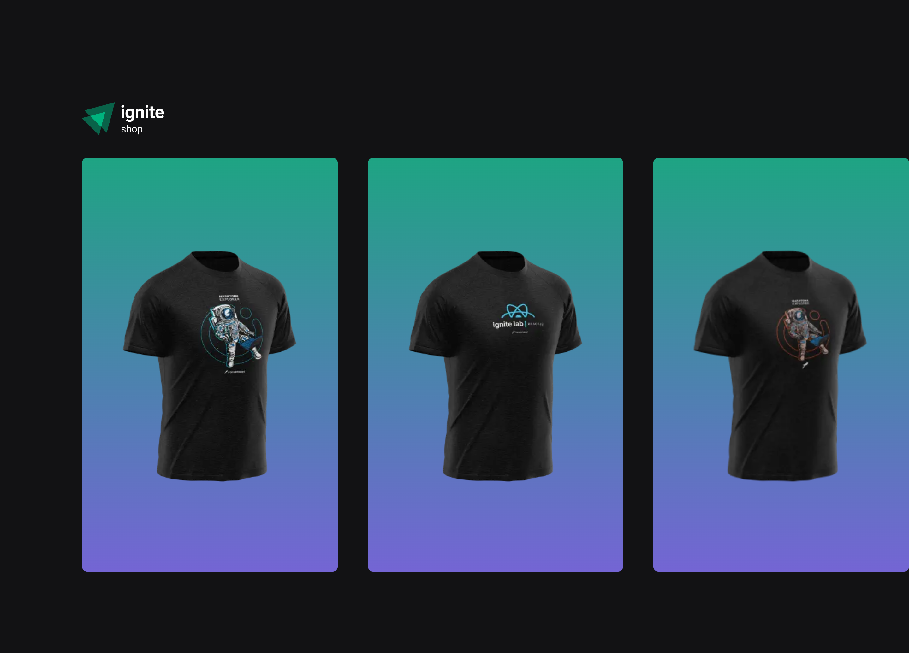
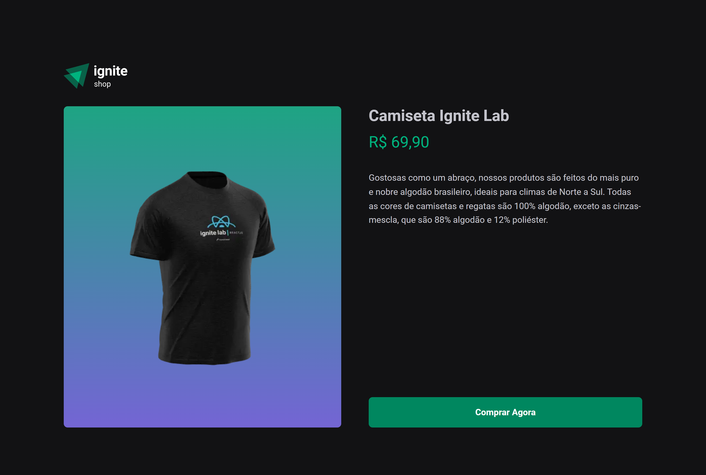

# Ignite Shop

<!---Esses são exemplos. Veja https://shields.io para outras pessoas ou para personalizar este conjunto de escudos. Você pode querer incluir dependências, status do projeto e informações de licença aqui--->


<a href="https://ignite-shop-sid.vercel.app/" target="_blank">Demo</a>



<br /> 
 
## 💻 Sobre

Este projeto é um e-commerce chamado Ignite Shop, construído usando o framework Next.js e a biblioteca Stripe. Ele foi desenvolvido com o objetivo de criar uma loja virtual simples e fácil de usar. O aplicativo permite que os usuários naveguem e comprem produtos, bem como gerenciem suas compras e informações de pagamento. A biblioteca Stripe é usada para garantir que os pagamentos sejam seguros e fáceis. O projeto foi desenvolvido para proporcionar uma experiência de compra on-line rápida e eficiente para os usuários.

<br />

## 🖱 Pré-requisitos

Antes de começar, verifique se você atendeu aos seguintes requisitos:

- Você instalou a versão mais recente de `node / npm / yarn`

- Sera necessário uma conta no stripe com produtos para serem listados na plataforma
  <br />

## ☕ Usando o Ignite Shop

Para usar o Ignite Shop, siga estas etapas:

```
git clone https://github.com/SidneyRoberto9/ignite-shop

yarn ou npm i

yarn start ou npm start
```
